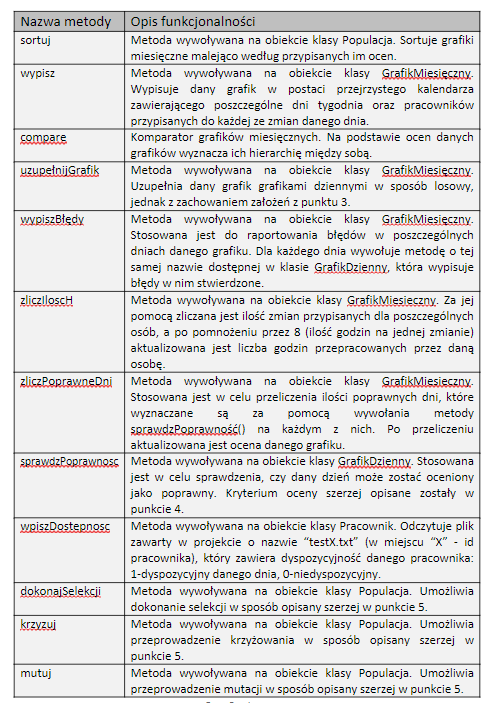
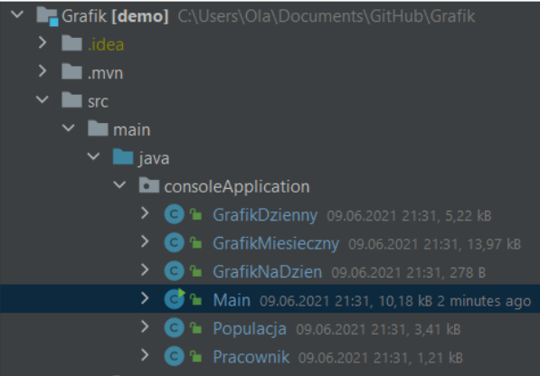
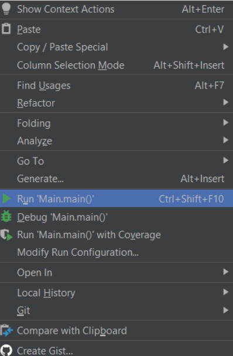
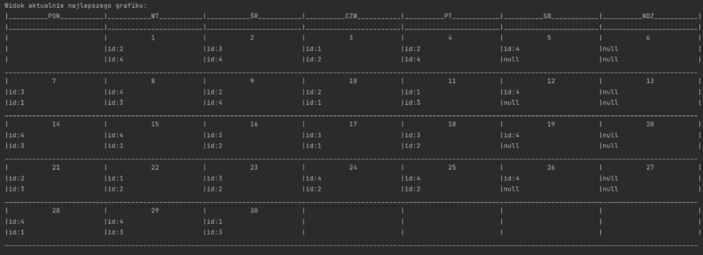
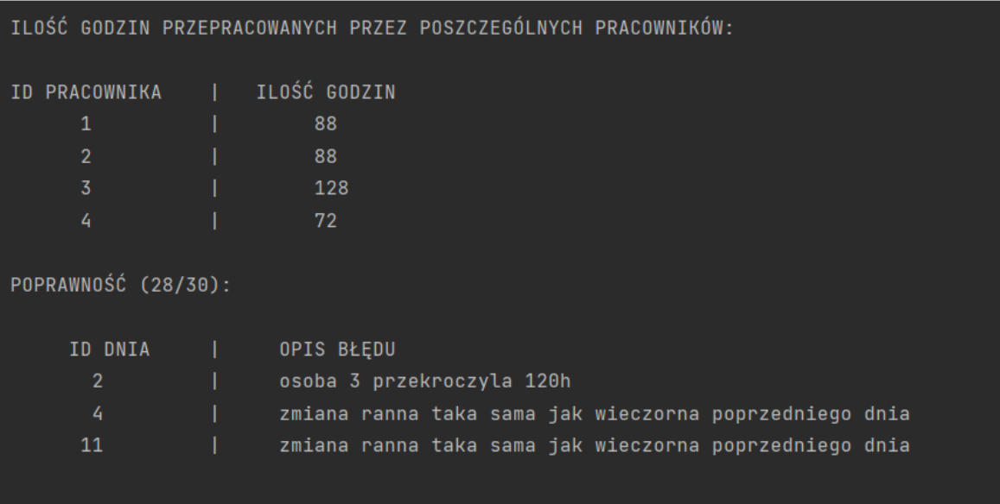
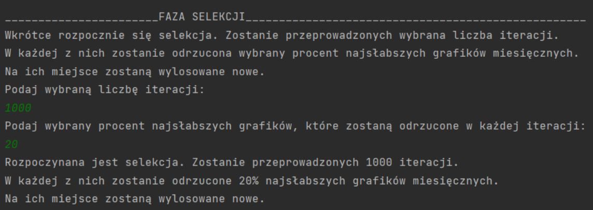
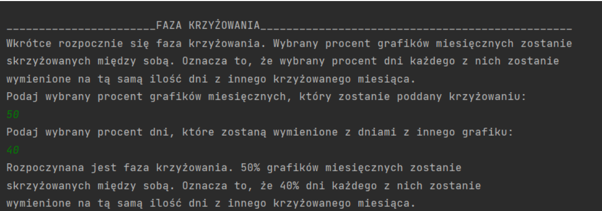
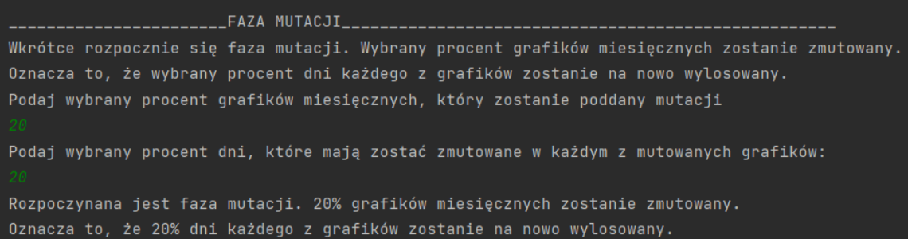

# ProjektGrafik

## Spis treści
* [Temat Projektu](#Temat-Projektu)
* [Opis Projektu](#Opis-Projektu)
* [Założenia Projektu](#Założenia-Projektu)
* [Kryteria Oceny](#Kryteria-Oceny)
* [Etapy Algorytmu Genetycznego](#Etapy-Algorytmu-Gentycznego)
* [Funkcjonalności](#Funkcjonalności)
* [Uruchomienie](#Uruchomienie)
* [Widoki](#Widoki)

## Temat Projektu
Projekt, tworzony w grupie dwuosobowej w oparciu o Sztuczną Inteligencję. Temat projektu to aplikacja umożliwiająca układanie miesięcznego grafiku pracowniczego.

## Opis Projektu
Projekt umożliwia przygotowanie miesięcznego grafiku pracowniczego dla konkretnego, 30-dniowego miesiąca, którego pierwszy dzień przypada we wtorek.
Za pomocą algorytmu genetycznego stopniowo ulepszane są stworzone losowo grafiki miesięczne. Co ważne, algorytm skonstruowany jest w ten sposób, że najlepszy 
wynik nigdy nie jest tracony. Projekt umożliwia także wprowadzanie przez użytkownika poszczególnych parametrów niezbędnych do przeprowadzenia kolejnych etapów
algorytmu genetycznego za pomocą konsoli. 

## Założenia Projektu
Stała ilość miejsc w firmie (4 pracowników)

• W firmie występują dwie zmiany - poranna i wieczorna

• Każda zmiana trwa 8 godzin

• Wszyscy pracownicy pracują na tym samym stanowisku

• Pracownik nie może pracować na dwie zmiany w ciągu jednego dnia

• W soboty pracuje tylko poranna zmiana

• Niedziele są wolne

Powyżej przedstawione założenia są z góry narzucone, tzn. grafiki tworzone są w sposób losowy, jednak w taki sposób, że każdy z nich spełnia wszystkie powyższe punkty.

## Kryteria Oceny
Aby móc dokonywać kolejnych etapów algorytmu genetycznego, należało stworzyć uniwersalną ocenę każdego z grafików. Utworzono więc funkcję sprawdzPoprawnosc(), 
która sprawdza każdy z dni w danym grafiku miesięcznym według następujących kryteriów:

• Jeżeli sprawdzany dzień to sobota, to nie może występować wieczorna zmiana

• Jeżeli sprawdzany dzień to niedziela, to nie może występować żadna zmiana

• W dniach innych niż sobota i niedziela obecny jest pracownik na ranną zmianę

• W dniach innych niż sobota i niedziela obecny jest pracownik na wieczorną zmianę

• Pracownik pracujący na ranną zmianę nie pracował na wieczorną zmianę w dniu poprzednim

• Żaden z pracowników w danym dniu nie przekroczył 120 przepracowanych godzin w ciągu miesiąca

Grafik na dany dzień zostaje uznany za poprawny tylko wtedy, gdy spełni każdy z wymienionych wyżej punktów. Zsumowana liczba w pełni poprawnych dni w danym grafiku
staje się przypisaną mu oceną, która z kolei stanowi kryterium oceny skuteczności poszczególnych grafików miesięcznych.

## Etapy Algorytmu Genetycznego
I.    Stworzenie populacji 11 osobników, tj. losowo stworzonych grafików miesięcznych, które spełniają założenia projektu wymienione w punkcie 3.

II.   Sortowanie według ocen, tj. według wyliczonej poprawności (opisane w punkcie 4.) grafiki sortowane są od malejąco ocenami.

III.  Faza selekcji. W podanej przez użytkownika liczbie iteracji przeprowadzana jest selekcja, tj. podany przez użytkownika procent najgorszych według oceny 
      grafików miesięcznych zostaje odrzucony, a na ich miejsce zostaje wylosowana taka sama ilość nowych grafików miesięcznych (według zasad opisanych w punkcie 3.). 
      Po każdej iteracji populacja jest ponownie sortowana według ocen.
      
IV.   Faza krzyżowania. W podanym przez użytkownika procencie grafików miesięcznych zostaje skrzyżowany między sobą podany przez użytkownika procent dziennych
      grafików. To znaczy, że dany procent grafików dziennych zostanie “wymieniony” z tym samym dniem w innym z krzyżowanych grafików miesięcznych.
      
V.    Faza mutacji. W podanym przez użytkownika procencie grafików miesięcznych zostaje zmutowany podany przez użytkownika procent dziennych grafików. To znaczy, 
      że dany procent grafików dziennych w każdym z mutowanych grafików miesięcznych zostanie wylosowany na nowo według zasad opisanych w punkcie 3.
      
VI.   Wykonanie wszystkich powyższych kroków oraz wypisanie grafiku miesięcznego z najlepszą oceną.

## Funkcjonalności

## Uruchomienie
Uruchomienie zostało przedstawione w IntelliJ IDEA i wygląda następująco: 

• W otworzonym projekcie wybrać klasę Main zaznaczoną na poniższym zrzucie ekranu: 

• Po kliknięciu prawym przyciskiem w obszar roboczy wybrać zaznaczoną opcję kompilacji programu:

• Praca programu przebiega bezpośrednio w konsoli IntelliJ IDEA. 

## Widoki
Zrzuty ekranu przedstawiające działanie programu w kluczowych momentach: 

• Raport przedstawiany po każdym z etapów opisanych w punkcie 5

• Faza selekcji 

• Faza krzyżowania 

• Faza mutacji 

